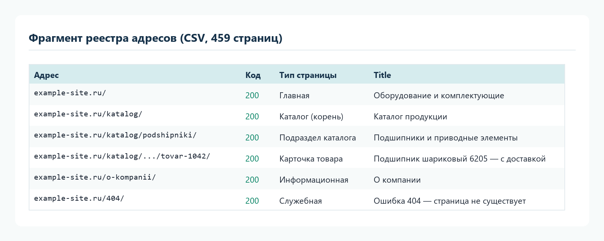
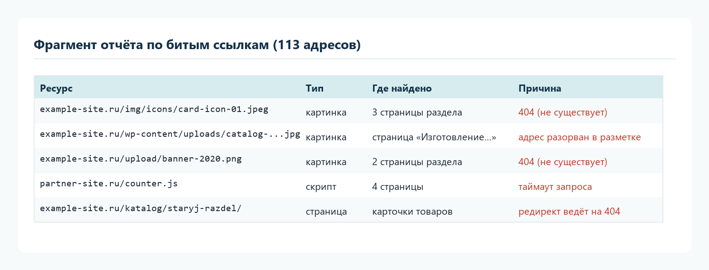
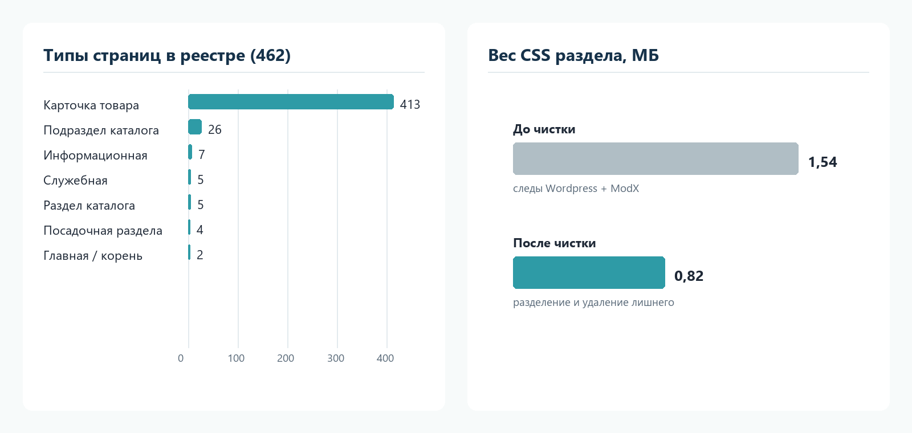
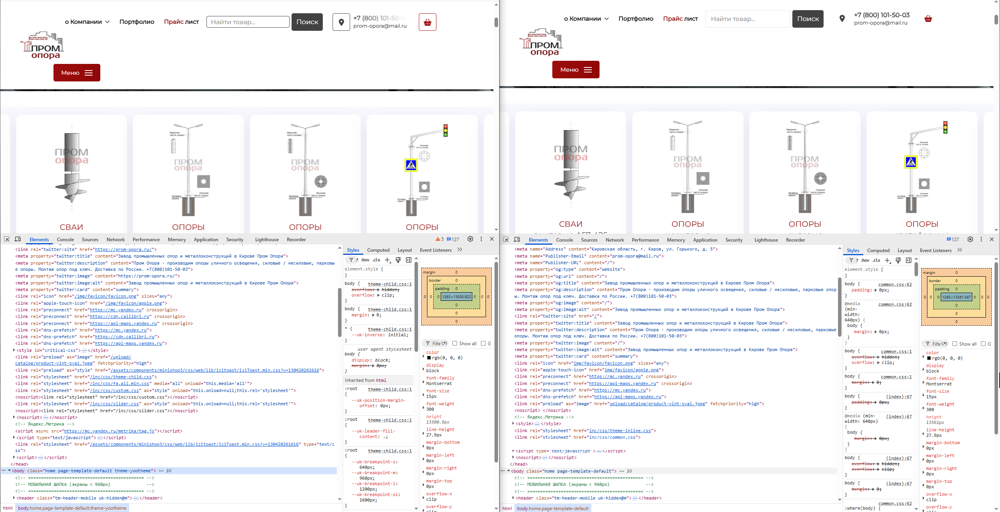
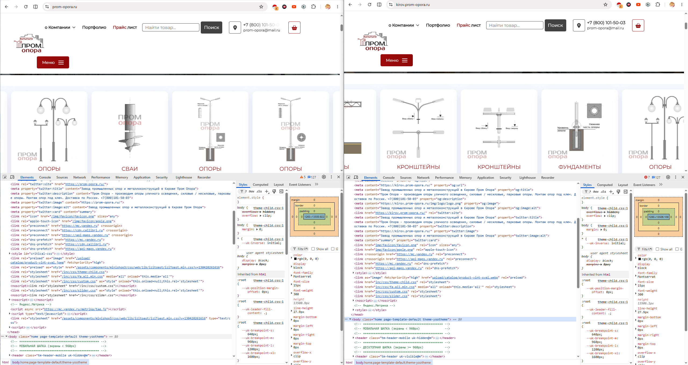
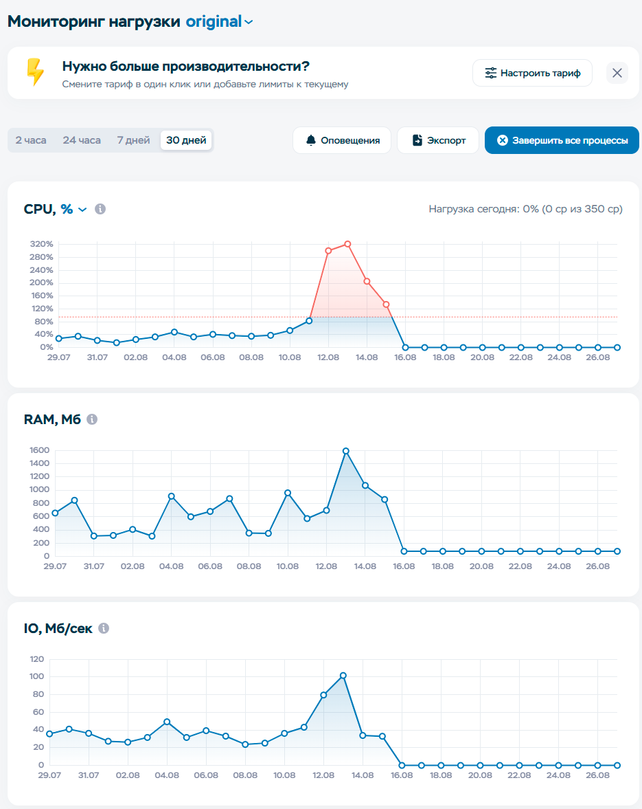
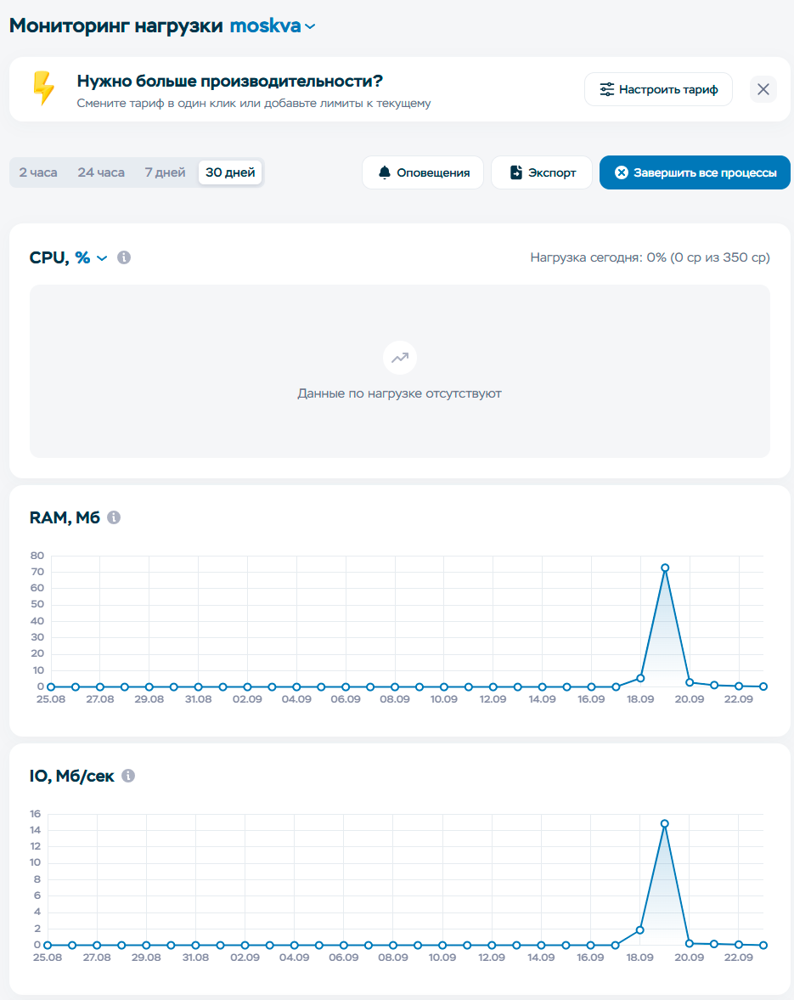

# Архивация и реабилитация старого сайта: метод работы

Описывает подход, под который собраны инструменты этого репозитария: как снять точный слепок старого сайта, вытащить его из устаревшего движка и пересобрать нужные разделы на чистой статике.

## Кому подходит

- Сайт годами дорабатывался разными подрядчиками, и никто не знает его полной структуры.
- Сайт пережил смену платформы, и в коде остались следы обеих систем.
- Готовится перенос на новый домен, редизайн или отказ от движка — а отправной точки в виде понятной карты сайта нет.

## Симптомы, с которыми сталкиваемся

Типичный случай из практики: сайт начинался на Wordpress/WooCommerce, затем дизайн вручную перенесли на ModX Revolution. При переносе в коде остались стили и скрипты Wordpress, к ним добавились новые от ModX Revo — сайт тянул две системы разом. Отсюда стандартные симптомы:

- страницы-дубли, адреса вне sitemap;
- ссылки на несуществующие ресурсы и битые изображения;
- лишние стили и скрипты, тяжёлые страницы;
- непонятно, сколько вообще страниц на сайте и какие они.

## Этапы метода

1. **Инвентаризация.** Разбор sitemap, обход всех страниц сайта, сбор мета-тегов и ссылок. Результат — CSV-реестр каждой страницы с типом, заголовком и статусом.
2. **Аудит.** Проверка доступности каждого адреса и ресурса, поиск битых ссылок, оценка веса страниц, классификация страниц по типам.
3. **Выгрузка полной статической копии.** Сайт сохраняется целиком, со всеми адресами и ресурсами, как страховка перед любыми работами.
4. **Чистка от следов движков.** Из копии убираются классы, скрипты и пути, оставшиеся от прежних платформ.
5. **Сборка разделов на статике.** Нужные страницы и каталоги пересобираются в самостоятельный HTML/CSS/JS без движка.
6. **Формы и аналитика.** Приём заявок по SMTP с журналом в CSV и защитой от спама; цели в Яндекс.Метрике.
7. **Приёмка.** Автоматическая проверка ссылок по всей копии, тесты форм и почты, отчёт по каждому этапу.

## Что получает заказчик

- CSV-реестр всех страниц сайта с типами, заголовками и статусами.
- Отдельный список битых ссылок и рекомендаций по устранению.
- Полную статическую копию сайта.
- Пересобранные разделы или лендинги, готовые к размещению на хостинге.
- Отчёт по каждому этапу: что сделано, какие решения приняты, что проверить после размещения.

## Примеры результатов

Фрагмент реестра адресов (адреса и названия обезличены):

Фрагмент отчёта по битым ссылкам:

Распределение страниц по типам и результат чистки стилей:

Сравнение кода исходной страницы (слева) и статической копии (справа): в копии меньше ссылок на стили и скрипты, следы движков убраны:

## Кейс в цифрах

Сайт промышленной тематики, в коде — следы двух систем (Wordpress и ModX Revo):

- 459 страниц — в инвентаризации адресов, каждая классифицирована по типу;
- 458 страниц — в полной статической копии;
- вес CSS раздела снижен с 1,54 до 0,82 МБ за счёт разделения и чистки стилей;
- 10 утраченных изображений восстановлены заглушками с картой замены;
- форма заявок проверена журналом и доставкой писем, почтовая схема — 10/10 в mail-tester;
- по каждому этапу — отчёт с решениями и чек-листом приёмки.

## Нагрузка на сервере: оригинал и копии

Данные мониторинга хостинга за 30-дневные окна: для оригинала и основного сайта — 29.07–26.08, для копий — 25.08–22.09.

| Сайт | Платформа | Пик CPU | Пик RAM | Пик IO |
| --- | --- | --- | --- | --- |
| пром-опора.рф (оригинал) | Wordpress | ~310 % — трёхкратное превышение лимита тарифа | ~1600 МБ | ~100 Мб/сек |
| prom-opora.ru (основной сайт) | ModX Revo | ~21 % | ~530 МБ | до 550 Мб/сек |
| moskva.prom-opora.ru (полная копия) | статика | превышений нет | ~72 МБ | ~15 Мб/сек |
| kirov.prom-opora.ru (лендинг) | статика | превышений нет | ~1,8 МБ | ~0,1 Мб/сек |

Оригинал на Wordpress в пике выходил за лимит тарифа по процессору и потреблял на порядок больше памяти, чем статические копии. Основной сайт на ModX Revo держится в пределах нормы по процессору, но дисковая активность у него в разы выше копий. Для копий пиковая нагрузка близка к нулю — страницы отдаются как готовые файлы.

Полный набор снимков по всем четырём площадкам и таблица соответствия — в `docs/assets/nagruzka/` (sootvetstvie-snimkov.csv).

## Чем отличается от обычного бэкапа

Бэкап сохраняет проблему в исходном виде. Этот метод сначала измеряет сайт (реестр, статусы, битые ссылки), затем убирает причины — следы движков, лишний код, битые адреса — и отдаёт заказчику версию, которую можно двигать дальше: переносить, обновлять, показывать поисковым системам.

## Состав инструментов репозитария

- `scripts/` — инвентаризация: разбор sitemap, обход страниц, проверка ссылок, сборка CSV-отчётов (Python, без сторонних библиотек).
- `.claude/skills/kopiya-sajtov/` — скилл для Claude Code: методика копирования сайтов (архив, лендинг, полная копия) со скриптом архивной выгрузки.
- `.claude/skills/formy-na-statike/` — скилл: формы заявки и почта на статике (SMTP, журнал-страховка, приёмка доставляемости).
- `kirov.prom-opora.ru/` — пример результата: статический лендинг с приёмом заявок (PHP, чистый SMTP-клиент), целями Метрики и сборочными скриптами.
- `docs/reports/` — примеры отчётности по этапам: планы, отчёты, чек-листы приёмки.

Примеры даны по реальному проекту: приватные данные (пароли, адреса, телефоны, номера счётчиков) заменены заглушками.